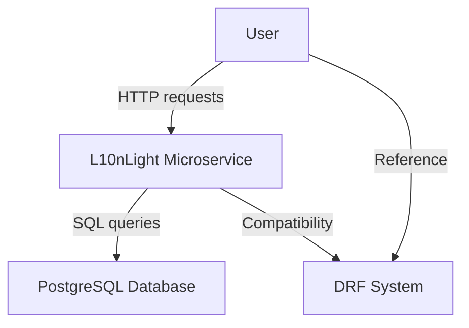
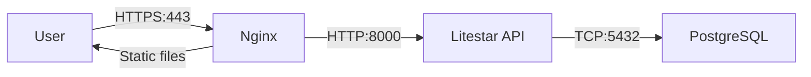
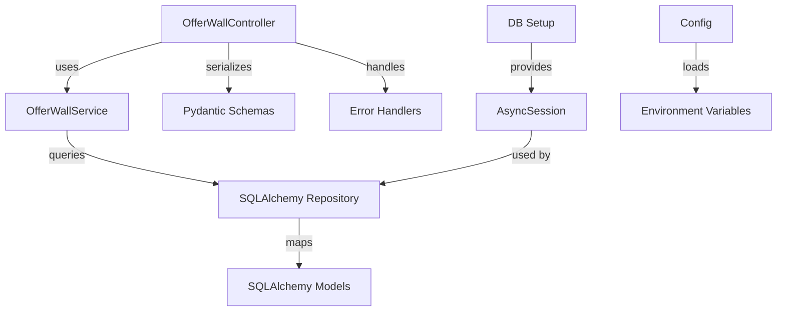
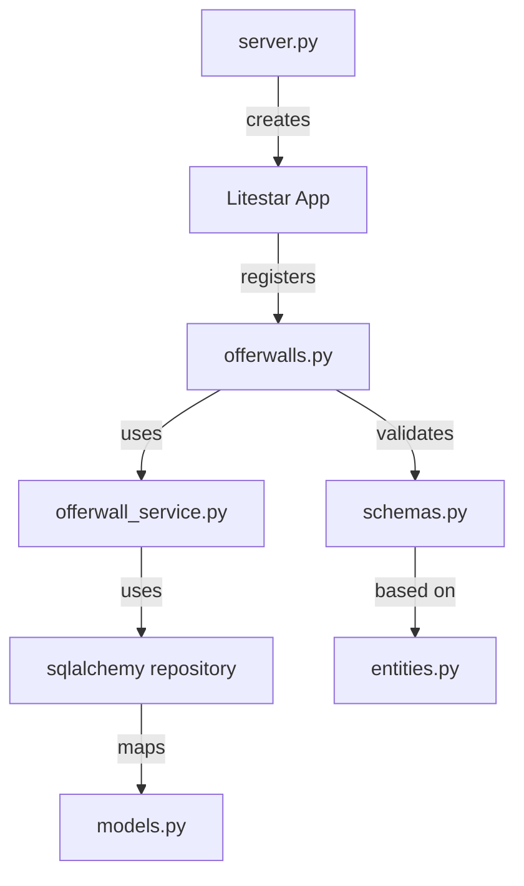
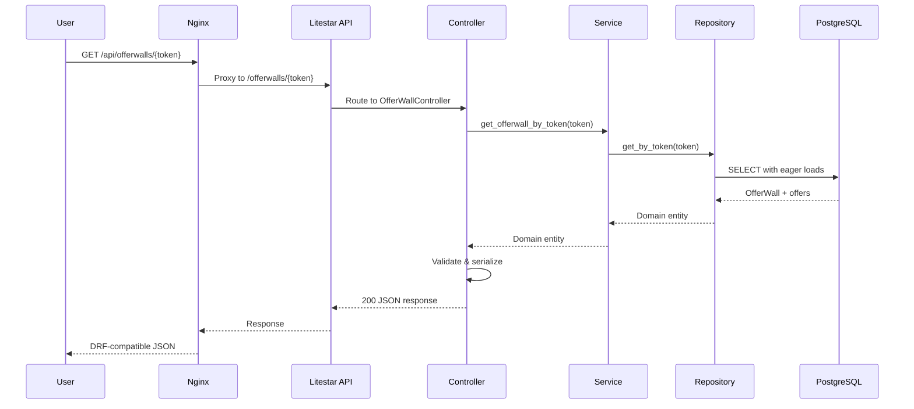
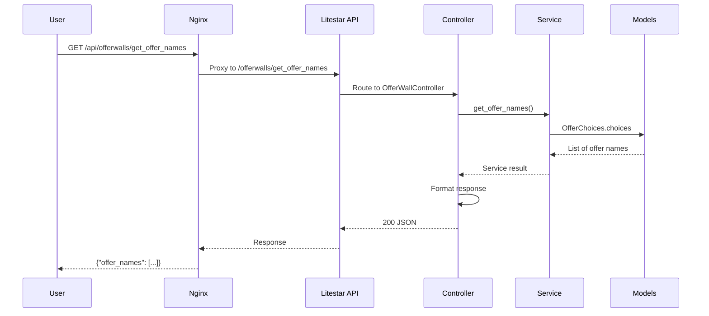
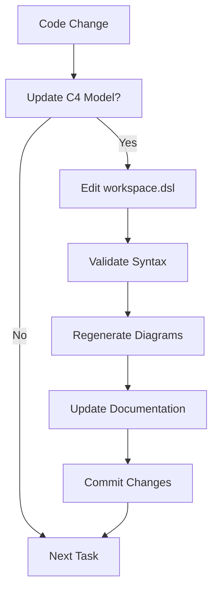

# 🏗️ C4 Architecture Documentation Guide

## 📋 Table of Contents
- [What is C4 Model?](#what-is-c4-model)
- [L10nLight C4 Overview](#l10nlight-c4-overview)
- [Level 1: Context](#level-1-context)
- [Level 2: Containers](#level-2-containers)
- [Level 3: Components](#level-3-components)
- [Level 4: Code](#level-4-code)
- [Dynamic Views](#dynamic-views)
- [Visualization Tools](#visualization-tools)
- [How to Update](#how-to-update)
- [Best Practices](#best-practices)

---

## 🎯 What is C4 Model?

**C4 = Context, Containers, Components, Code**

C4 Model is a simple approach to software architecture documentation that helps teams:

- 🎯 **Understand** the system at different abstraction levels
- 🏗️ **Communicate** architecture decisions effectively
- 📋 **Document** system structure consistently
- 🔄 **Maintain** documentation alongside code

### 📊 The 4 Levels:

| Level | Focus | Audience | Artifacts |
|-------|-------|-----------|-----------|
| **1: Context** | System boundaries | Everyone | System Landscape |
| **2: Containers** | High-level technology | DevOps, Architects | Container Diagram |
| **3: Components** | Internal structure | Developers | Component Diagram |
| **4: Code** | Implementation details | Developers | Class Diagrams, UML |

---

## 🌟 L10nLight C4 Overview

### 📋 System Description
**L10nLight** is a modern asynchronous microservice built with **Litestar** framework that replicates Django REST Framework functionality for managing offer walls and associated offers.

### 🎯 Architecture Goals
- ⚡ **High Performance**: Async/await throughout
- 🏗️ **Clean Architecture**: Domain-driven design
- 🔒 **Type Safety**: Full type annotations
- 🐳 **Container Ready**: Docker-native deployment
- 🧪 **Testable**: Comprehensive test coverage

---

## 📍 Level 1: Context

### 🌍 System Landscape

```
┌─────────────┐    HTTP     ┌─────────────┐    API      ┌─────────────┐
│    User     │ ────────→   │  L10nLight  │ ────────→   │   DRF Ref   │
│             │             │ Microservice│             │   System    │
└─────────────┘             └─────────────┘             └─────────────┘
                                │
                                │ SQL
                                ↓
                         ┌─────────────┐
                         │ PostgreSQL  │
                         │  Database   │
                         └─────────────┘
```

### 📝 Context Description

| Element | Description | Technology |
|---------|-------------|------------|
| **User** | End user consuming the API | HTTP Client |
| **L10nLight** | Main microservice system | Python/Litestar |
| **DRF Ref System** | Reference Django REST API | Django/DRF |
| **PostgreSQL** | Primary data storage | PostgreSQL 16+ |

### 🔄 Interactions



### 📋 Context DSL (from workspace.dsl)
```dsl
user = person "User" "End user consuming the API"
drf = softwareSystem "Existing DRF System" "Reference API for parity" { tags "External" }
ms = softwareSystem "Offer Admin Microservice (Litestar)" "Isolated service with async SQLAlchemy and pydantic-settings"
```

---

## 🏢 Level 2: Containers

### 🐳 Container Architecture

```
┌─────────────────────────────────────────────────────────────┐
│                    L10nLight System                         │
├─────────────────┬─────────────────┬─────────────────────────┤
│     Nginx       │   Litestar API  │      PostgreSQL         │
│                 │                 │                         │
│ • Reverse proxy │ • Python 3.12   │ • PostgreSQL 16+        │
│ • SSL termination│ • Granian ASGI  │ • Async connections     │
│ • Load balancing│ • Pydantic      │ • Persistent storage    │
│ • Static files  │ • SQLAlchemy    │                         │
└─────────────────┴─────────────────┴─────────────────────────┘
```

### 📋 Container Details

| Container | Responsibility | Technology | Ports |
|-----------|----------------|------------|-------|
| **Nginx** | Reverse proxy, SSL termination | Nginx 1.27 | 80, 443 |
| **Litestar API** | Business logic, API endpoints | Python 3.12, Granian | 8000 |
| **PostgreSQL** | Data persistence | PostgreSQL 16 | 5432 |

### 🔄 Container Interactions



### 📋 Container DSL
```dsl
nginx = container "Nginx" "Reverse proxy forwarding /api/* to Litestar" "Nginx" { tags "Container" }
api = container "Litestar API" "Python 3.12, Granian/UVicorn runtime, Litestar ASGI app" "Python/Litestar" { tags "Container" }
db = container "PostgreSQL" "Persistent storage for offers and offer walls" "Postgres"
```

---

## ⚙️ Level 3: Components

### 🧩 Litestar API Components

```
┌─────────────────────────────────────────────────────────────┐
│                Litestar API Container                      │
├─────────────────┬─────────────────┬─────────────────────────┤
│   Controllers   │     Services    │      Infrastructure     │
│                 │                 │                         │
│ • OfferWall     │ • OfferWall     │ • SQLAlchemy Models     │
│   Controller    │   Service       │ • DB Setup              │
│                 │                 │ • Config                │
│ • Error Handlers│                 │ • Error Handlers        │
│                 │                 │                         │
│ • Pydantic      │                 │ • AsyncSession DI       │
│   Schemas       │                 │                         │
└─────────────────┴─────────────────┴─────────────────────────┘
```

### 📋 Component Details

| Component | Responsibility | Technology | Dependencies |
|-----------|----------------|------------|--------------|
| **OfferWallController** | HTTP endpoints, routing | Litestar | Service, Schemas, Models |
| **OfferWallService** | Business logic | Python | Repository, Entities |
| **Pydantic Schemas** | Validation, serialization | Pydantic | Models |
| **SQLAlchemy Models** | Data models | SQLAlchemy | Base |
| **DB Setup** | Database connections | SQLAlchemy | Config |
| **Config** | Configuration management | Pydantic Settings | .env files |
| **Error Handlers** | Error responses | Litestar | HTTP status codes |

### 🔄 Component Interactions



### 📋 Component DSL
```dsl
controller = component "OfferWallController" "HTTP endpoints: GET /offerwalls/{token}, GET /offerwalls/get_offer_names" "Litestar Controller"
schemas = component "Pydantic Schemas" "Response models mirroring DRF serializers" "Pydantic"
models = component "SQLAlchemy Models" "Offer, OfferWall, OfferAssignment, PopupAssignment" "SQLAlchemy"
db_setup = component "DB Setup" "Async engine, session maker, init_db, DI for AsyncSession" "SQLAlchemy Async"
config = component "Config (pydantic-settings)" "Loads .env with APP_*: server, DB URL, CORS" "Pydantic Settings"
errors = component "Error Handlers" "DRF-compatible 404 and validation handling" "Litestar"
```

---

## 📝 Level 4: Code

### 🔧 Code Structure

```
app/
├── 📁 domain/                 # Domain Layer
│   ├── entities.py           # Business entities
│   └── ports/                # Repository interfaces
├── 📁 application/           # Application Layer  
│   └── offerwall_service.py  # Business logic
├── 📁 infrastructure/        # Infrastructure Layer
│   └── sqlalchemy/           # Repository implementations
├── 📁 routes/                # Presentation Layer
│   └── offerwalls.py         # API controllers
├── 📁 schemas.py             # Pydantic schemas
├── 📁 models.py              # SQLAlchemy models
└── 📁 server.py              # Application entry
```

### 📋 Code Elements

| File/Module | Purpose | Key Classes/Functions |
|-------------|---------|----------------------|
| **entities.py** | Domain entities | `Offer`, `OfferWall`, `OfferAssignment` |
| **offerwall_service.py** | Business logic | `OfferWallService` |
| **offerwalls.py** | API endpoints | `OfferWallController` |
| **schemas.py** | Data validation | `OfferSchema`, `OfferWallSchema` |
| **models.py** | Database models | `Offer`, `OfferWall`, `OfferAssignment` |
| **server.py** | Application setup | `create_app()` |

### 🔄 Code Dependencies



---

## 🔄 Dynamic Views

### 🌊 Request Flow: Get OfferWall by Token



### 🌊 Request Flow: Get Offer Names



### 📋 Dynamic DSL
```dsl
dynamic "Get OfferWall by Token" {
  user -> nginx "GET /api/offerwalls/{token}"
  nginx -> api "Proxy to ASGI"
  api -> controller "Route: /offerwalls/{token}"
  controller -> db_setup "Obtain AsyncSession"
  db_setup -> db "SELECT OfferWall + assignments + offers"
  controller -> schemas "Validate & serialize"
  controller -> user "200 JSON (DRF-compatible)"
}
```

---

## 🎨 Visualization Tools

### 🐳 Option 1: Structurizr Lite (Recommended)

```bash
# Run Structurizr Lite with Docker
docker run -p 8080:8080 \
  -v $(pwd)/docs/c4:/usr/local/structurizr \
  structurizr/lite

# Open browser
open http://localhost:8080
```

**Features:**
- 🎨 Interactive diagrams
- 🔄 Real-time editing
- 📱 Mobile friendly
- 📐 Auto-layout

### 💻 Option 2: Structurizr CLI

```bash
# Install Structurizr CLI
npm install -g structurizr-cli

# Export diagrams
structurizr-cli export -workspace docs/c4/workspace.dsl -format plantuml

# Generate PNG/SVG
structurizr-cli export -workspace docs/c4/workspace.dsl -format png
```

### 🖥️ Option 3: Structurizr Desktop

1. Download Structurizr Desktop
2. Open `docs/c4/workspace.dsl`
3. View interactive diagrams
4. Export to various formats

### 🌐 Option 4: Online Tools

- **PlantUML Online**: https://plantuml.com/online
- **Mermaid Live Editor**: https://mermaid.live/
- **Draw.io**: https://app.diagrams.net/

---

## 📝 How to Update Documentation

### 🔄 Updating C4 Model

1. **Edit workspace.dsl**
   ```bash
   vim docs/c4/workspace.dsl
   ```

2. **Validate syntax**
   ```bash
   structurizr-cli validate -workspace docs/c4/workspace.dsl
   ```

3. **Regenerate diagrams**
   ```bash
   structurizr-cli export -workspace docs/c4/workspace.dsl -format png
   ```

4. **Commit changes**
   ```bash
   git add docs/c4/workspace.dsl
   git commit -m "Update C4 model: add new component"
   git push origin main
   ```

### 📋 Adding New Components

```dsl
# Example: Adding Cache Component
cache = component "Redis Cache" "Caches offer wall responses" "Redis" {
  tags "Component"
}

# Add interactions
controller -> cache "Check cache"
cache -> controller "Return cached response"
```

### 🔄 Updating Dynamic Views

```dsl
# Example: Adding new request flow
dynamic "Create OfferWall" {
  user -> nginx "POST /api/offerwalls"
  nginx -> api "Proxy to ASGI"
  api -> controller "Route: POST /offerwalls"
  controller -> service "create_offerwall(data)"
  service -> repository "save(entity)"
  repository -> db "INSERT INTO offer_walls"
  controller -> user "201 Created"
}
```

---

## 🎯 Best Practices

### 📋 Documentation Guidelines

1. **Keep it Simple** - Use clear, concise descriptions
2. **Be Consistent** - Use same naming conventions
3. **Stay Current** - Update with code changes
4. **Focus on Audience** - Target appropriate abstraction level
5. **Use Visual Elements** - Diagrams > text

### 🔄 Maintenance Workflow



### 📋 Review Checklist

- [ ] **Context**: All external systems identified
- [ ] **Containers**: Technology stack accurate
- [ ] **Components**: Dependencies correct
- [ ] **Dynamic**: Request flows current
- [ ] **Naming**: Consistent terminology
- [ ] **Styling**: Visual hierarchy clear
- [ ] **Documentation**: Descriptions helpful

### 🎨 Visual Styling

```dsl
styles {
  element "External" { background "#bbbbbb" border "#888888" }
  element "Container" { background "#1168bd" color "#ffffff" }
  element "Person" { shape "Person" }
  element "Software System" { background "#438dd5" color "#ffffff" }
  element "Component" { background "#85bb65" color "#000000" }
}
```

---

## 🚀 Advanced Usage

### 📊 Integration with CI/CD

```yaml
# .github/workflows/c4-docs.yml
name: Update C4 Documentation
on:
  push:
    paths:
      - 'docs/c4/**'
      - 'app/**'

jobs:
  update-diagrams:
    runs-on: ubuntu-latest
    steps:
      - uses: actions/checkout@v3
      - name: Generate diagrams
        run: |
          docker run -v $(pwd):/workspace structurizr/cli \
            export -workspace /workspace/docs/c4/workspace.dsl -format png
      - name: Commit diagrams
        run: |
          git add docs/c4/*.png
          git commit -m "Auto-update C4 diagrams"
          git push
```

### 🔍 Automated Validation

```bash
# Pre-commit hook for C4 validation
#!/bin/bash
# .git/hooks/pre-commit

# Validate C4 model on changes
if git diff --cached --name-only | grep -q "docs/c4/workspace.dsl"; then
    echo "Validating C4 model..."
    structurizr-cli validate -workspace docs/c4/workspace.dsl
    if [ $? -ne 0 ]; then
        echo "C4 model validation failed!"
        exit 1
    fi
fi
```

### 📚 Team Training

1. **Onboarding**: Use Level 1-2 for new team members
2. **Development**: Use Level 3-4 for implementation
3. **Architecture Reviews**: Use all levels for design decisions
4. **Stakeholder Communication**: Use Level 1-2 for presentations

---

## 🎯 Conclusion

C4 documentation provides a **clear, maintainable, and comprehensive** view of the L10nLight microservice architecture:

- 🎯 **Context**: System boundaries and interactions
- 🏗️ **Containers**: Technology stack and deployment
- ⚙️ **Components**: Internal structure and dependencies  
- 📝 **Code**: Implementation details and patterns

This documentation serves as a **living architecture blueprint** that evolves with the system and helps teams:

- 🚀 **Onboard faster** with clear system understanding
- 🔄 **Communicate effectively** using shared visual language
- 📋 **Make informed decisions** with complete architectural context
- 🎨 **Maintain consistency** across development efforts

**Keep this documentation updated alongside your code for maximum value!** 🌟

---

## 📞 Support and Resources

- 📖 **C4 Model**: https://c4model.com/
- 🛠️ **Structurizr**: https://structurizr.com/
- 🌐 **Live Documentation**: http://localhost:8080 (when running Structurizr Lite)
- 📧 **Issues**: https://github.com/soewal19/L10nLight/issues
